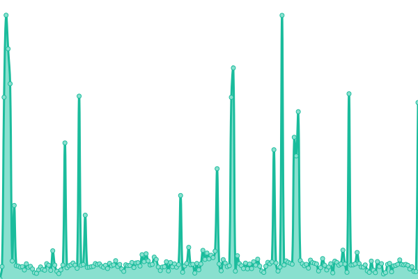
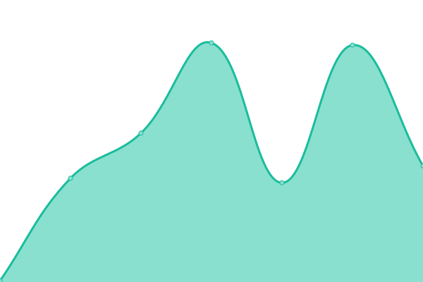

# [📈 Live Status](https://kevinlangleyjr.upptime.js.org): <!--live status--> **🟧 Partial outage**

This repository contains the open-source uptime monitor and status page for [Kevin Langley Jr.](https://kevinlangleyjr.dev), powered by [Upptime](https://github.com/upptime/upptime).

With [Upptime](https://upptime.js.org), you can get your own unlimited and free uptime monitor and status page, powered entirely by a GitHub repository. We use [Issues](https://github.com/kevinlangleyjr/upptime/issues) as incident reports, [Actions](https://github.com/kevinlangleyjr/upptime/actions) as uptime monitors, and [Pages](https://kevinlangleyjr.upptime.js.org) for the status page.

<!--start: status pages-->
<!-- This summary is generated by Upptime (https://github.com/upptime/upptime) -->
<!-- Do not edit this manually, your changes will be overwritten -->
<!-- prettier-ignore -->
| URL | Status | History | Response Time | Uptime |
| --- | ------ | ------- | ------------- | ------ |
|  [Kevin Langley Jr. Main Site](https://kevinlangleyjr.dev) | 🟩 Up | [kevin-langley-jr-main-site.yml](https://github.com/kevinlangleyjr/upptime/commits/HEAD/history/kevin-langley-jr-main-site.yml) | 

 187ms
     
 | 

<a href="https://kevinlangleyjr.github.io/upptime/history/kevin-langley-jr-main-site">100.00%</a>
    

|  [kevinlangleyjr.com Redirect](https://kevinlangleyjr.com) | 🟩 Up | [kevinlangleyjr-com-redirect.yml](https://github.com/kevinlangleyjr/upptime/commits/HEAD/history/kevinlangleyjr-com-redirect.yml) | 

 91ms
     
 | 

<a href="https://kevinlangleyjr.github.io/upptime/history/kevinlangleyjr-com-redirect">100.00%</a>
    

|  [k3v0.com Redirect](https://k3v0.com) | 🟩 Up | [k3v0-com-redirect.yml](https://github.com/kevinlangleyjr/upptime/commits/HEAD/history/k3v0-com-redirect.yml) | 

 157ms
     
 | 

<a href="https://kevinlangleyjr.github.io/upptime/history/k3v0-com-redirect">100.00%</a>
    

|  [k3v0.dev Redirect](https://k3v0.dev) | 🟩 Up | [k3v0-dev-redirect.yml](https://github.com/kevinlangleyjr/upptime/commits/HEAD/history/k3v0-dev-redirect.yml) | 

 167ms
     
 | 

<a href="https://kevinlangleyjr.github.io/upptime/history/k3v0-dev-redirect">100.00%</a>
    

|  [ubergeni.us Redirect](https://ubergeni.us) | 🟥 Down | [ubergeni-us-redirect.yml](https://github.com/kevinlangleyjr/upptime/commits/HEAD/history/ubergeni-us-redirect.yml) | 

 0ms
     
 | 

<a href="https://kevinlangleyjr.github.io/upptime/history/ubergeni-us-redirect">5.45%</a>
    

|  [Function Labs](https://functionlabs.io) | 🟩 Up | [function-labs.yml](https://github.com/kevinlangleyjr/upptime/commits/HEAD/history/function-labs.yml) | 

 41ms
     
 | 

<a href="https://kevinlangleyjr.github.io/upptime/history/function-labs">100.00%</a>
    

|  [Scrum.to Marketing Site](https://scrum.to) | 🟩 Up | [scrum-to-marketing-site.yml](https://github.com/kevinlangleyjr/upptime/commits/HEAD/history/scrum-to-marketing-site.yml) | 

 377ms
     
 | 

<a href="https://kevinlangleyjr.github.io/upptime/history/scrum-to-marketing-site">100.00%</a>
    

|  [Scrum.to App](https://app.scrum.to) | 🟩 Up | [scrum-to-app.yml](https://github.com/kevinlangleyjr/upptime/commits/HEAD/history/scrum-to-app.yml) | 

 274ms
     
 | 

<a href="https://kevinlangleyjr.github.io/upptime/history/scrum-to-app">100.00%</a>
    

|  [Scrum.to API](https://api.scrum.to) | 🟩 Up | [scrum-to-api.yml](https://github.com/kevinlangleyjr/upptime/commits/HEAD/history/scrum-to-api.yml) | 

 231ms
     
 | 

<a href="https://kevinlangleyjr.github.io/upptime/history/scrum-to-api">100.00%</a>
    

<!--end: status pages-->

[**Visit our status website →**](https://kevinlangleyjr.upptime.js.org)

## 📄 License

- Powered by: [Upptime](https://github.com/upptime/upptime)
- Code: [MIT](./LICENSE) © [Kevin Langley Jr.](https://kevinlangleyjr.dev)
- Data in the `./history` directory: [Open Database License](https://opendatacommons.org/licenses/odbl/1-0/)
